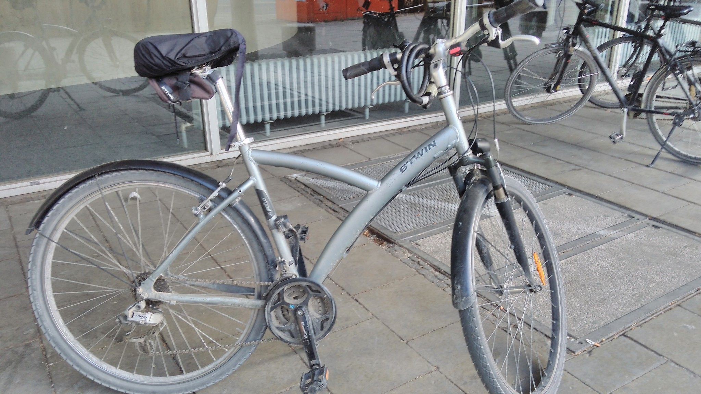

== Moebel zu verkaufen (Verfuegbar ab Anfang Juni)

:toc:

//=== Kleiderschrank mit Tuerdaempfer (400 euros)
//****
//*Moemax, link:https://www.moemax.de/p/modern-living-schiebetuerenschrank-in-eichefarben-002522014303[Referenz]* +
//*270 x 225 x 61 cm* +
//*Orignal Preis: 560 eur (06/2017)*
//
//
//****

=== Waschmaschine 5kg (170 euros)
****
*Beko, link:https://www.amazon.de/gp/product/B018KDB8WC/ref=ppx_yo_dt_b_search_asin_title?ie=UTF8&psc=1[Referenz]* +
*41,5 x 60 x 84 cm* +
*Kaufpreis: 275 euros (04/2017)*

****

=== Ecksofa bett (85 euros)
****
*IKEA, link:https://www.ikeaddict.com/ikeapedia/en/Product/90214134/us-en/lugnvik-sofa-bed-with-chaise-lounge-granan-black/Entry/[Referenz]* +
*Sofa: 223 x 83 (max 136) cm / Bed: 120 x 200 cm* +
*Kaufpreis: 250 euros (09/2015)*

 +

****

//=== Fahrrad 26"/28" Trekkingrad Alu Grau (80 euros)
//****
//*Decathlon B'twin* +
//*Referenz: FAHRRAD 26"/28" TREKKINGRAD ORIGINAL 500 ALU SILBERGRAU HELLGRAU L* +
//*Kaufpreis: 250 euros (03/2015)*
//
//
//
//****

//=== Weinkeller (60 euros)
//****
//*Bomann, > 4 Jahre, link:https://www.amazon.de/Bomann-KSW-345-Weink%C3%BChlschrank-Temperatursteuerung/dp/B00E0FQTHO/ref=sr_1_fkmrnull_1?__mk_de_DE=%C3%85M%C3%85%C5%BD%C3%95%C3%91&keywords=ksw+345&qid=1555688688&s=gateway&sr=8-1-fkmrnull[Referenz]* +
//*51,6 x 34,5 x 63,5 cm* +
//Guter Zustand aber kann manchmal bisschen laut sein.
//
//
//
//
//****

=== Regal mit glastuer (40 euros)
****
*IKEA, link:https://www.ikeaddict.com/ikeapedia/en/Product/s29903032/fr-fr/borgsjo-etagere-avec-panneau-portes-vitrees-blanc/Entry/[Referenz]* +
*181 x 75 x 42 cm*

****

#=== TV-Moebel (weiss) (40 euros)
#****
#*IKEA, link:https://www.ikeaddict.com/ikeapedia/en/Product/s89903034/ca-fr/borgsjo-meuble-tele-avec-tiroirs-blanc/Entry/[Referenz]* +
#*150 x 42 x 51 cm*
#
#
#
#
#****

=== Bad Waschbekenunterschrank (30 euros)
****
*Moemax* +
*60 x 55 x 31 cm* +
*Kaufpreis: 79,90 eur (04/2017)* +

****

=== Nespresso Maschine (10 euros)
****
*Krups Cityz, ca 10 Jahre, link:https://www.amazon.fr/Krups-Nespresso-XN7002-xn7002-Nespresso-Citiz/dp/B003XN7HXY[Referenz]* +
Guter Zustand

****

//=== Bad Hochschrank (30 euros)
//****
//*Moemax, link:https://moemax.a.bigcontent.io/v1/static/PIGGuqa_64F-K42i_GEecNog/1803-wojcik.pdf[Referenz]* +
//*40 x 164 x 33 cm* +
//*Kaupreis: 60 eur (06/2017)*
//
//
//
//
//****

//=== Regale, schwarz (5 euros)
//****
//*IKEA, link:https://www.ikea.com/de/de/p/billy-buecherregal-schwarzbraun-40263848/[Referenz]* +
//*80 x 28 x 202 cm*
//
//
//****

=== Badmoebel (zu verschenken)
****
*Weiss, Viel Jahren* +
58 (T) x 45 x 86.5 (H) cm

****

#=== Kleine kleiderschrank (zu geben)
#****
#*IKEA, 6 Jahre* +
#*link:https://www.ikea.com/de/de/p/dombas-kleiderschrank-weiss-50270136/[Referenz]* +
#*140 x 181 x 51 cm* +
#Mittlerer Zustand
#
#
#
#
#****
